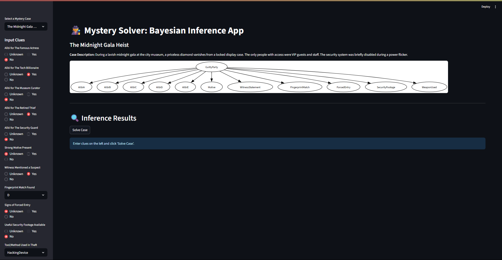
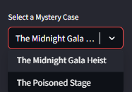
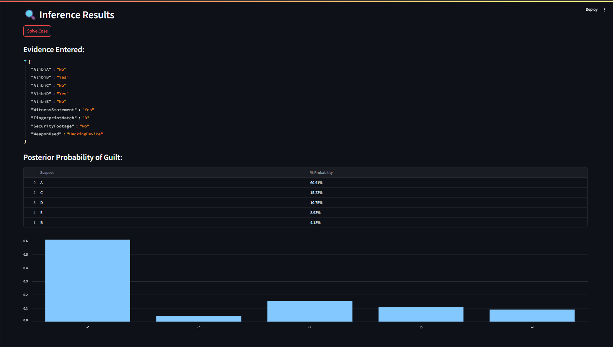
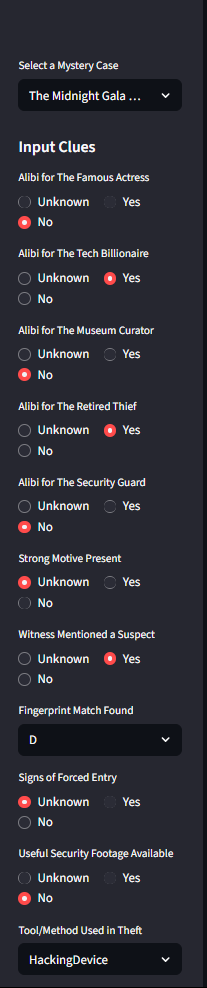
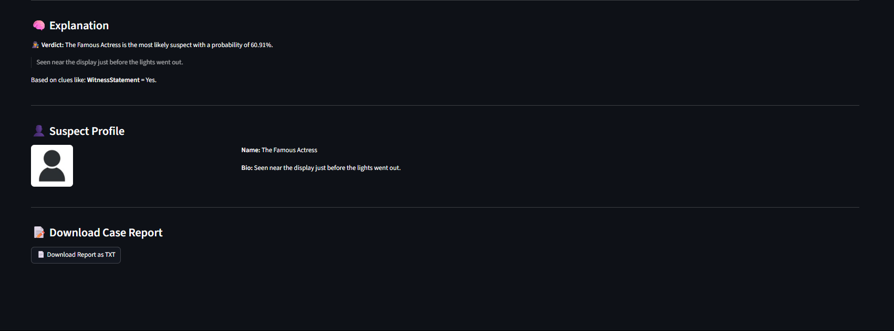

# 🕵️ Mystery Solver: Bayesian Inference App

This interactive web application helps solve fictional mystery cases using **Bayesian Networks** and **probabilistic reasoning**. Users enter clues (like alibis, witness reports, fingerprints), and the system calculates which suspect is most likely guilty — complete with visual graphs, explanations, and a downloadable case report.

---

## 📌 Features

- 🔎 Choose from multiple mystery scenarios (e.g., *Midnight Gala Heist*)
- 🧠 Uses Bayesian Inference to model uncertainty and make deductions
- ✅ Dynamic clues (Alibi, Motive, Witness, Fingerprints, etc.)
- 📊 Live probability charts and detailed inference results
- 🧾 Generates natural-language explanations for verdicts
- 👤 Displays suspect profile with image and bio
- 📄 Downloadable case report summarizing all findings

---

## 🚀 Getting Started

### 1. Clone the Repository
```bash
git clone https://github.com/NaimaRoshni/Mystery_Solver.git
cd mystery-solver
```

### 2. Set Up Python Environment
```bash
conda create -n mystery_solver python=3.10
conda activate mystery_solver
conda init
conda install -c conda-forge graphviz
pip install -r requirements.txt
```

### 3. Run the App
```bash
streamlit run main.py
```

## 🗂️ Project Structure
```bash
mystery_solver/
├── main.py                    # Streamlit UI logic
├── supports/
│   ├── mystery_solver.py      # Bayesian model & CPDs
│   ├── scenario_loader.py     # Loads .json mystery cases
│   └── explainer.py           # Generates human-readable verdicts
├── assets/
│   ├── suspects/              # Profile images (A.jpg, B.jpg, ...)
│   └── cases/                 # Case files (midnight_gala.json, ...)
│   └── screenshots/           # Screenshots of interface
├── requirements.txt
└── README.md
```

## 📂 Adding New Cases
- Create a new JSON file under `assets/cases/`
- Structure it like this:
```bash
{
  "case_id": "case_id",
  "title": "Case Title",
  "description": "Short scenario description.",
  "suspects": {
    "A": {
      "name": "Suspect A",
      "description": "Bio about suspect A.",
      "image": "A.jpg"
    }
    ...
  },
  "evidence": [
    { "node": "AlibiA", "label": "Alibi for Suspect A" },
    ...
  ]
}
```

- Add corresponding images (e.g., A.jpg) into `assets/suspects/`


## 📖 Technologies Used
- `pgmpy`: Probabilistic Graphical Models (Bayesian Networks)

- `streamlit`: Fast, reactive user interface for Python

- `pandas`, `numpy`: Data handling

- `graphviz`: Visualizing the model structure

## 📄 Example Use Case

### 🕵️ The Midnight Gala Heist

A priceless diamond vanishes during a grand gala at the city museum. You input clues like:

- **AlibiD** = `No`
- **FingerprintMatch** = `D`
- **Motive** = `Yes`

The system replies:

> 🧠 **The Retired Thief** is the most likely suspect with a probability of **77%**.

It also generates a full downloadable report summarizing:
- Your entered evidence
- Inference results (posterior probabilities)
- Natural-language explanation
- Suspect profile (name, bio, image)

## 📸 Screenshots

Below are some visuals from the Mystery Solver app to showcase its features:

### 🖼️ User Interface
Clean and organized layout using Streamlit.


### 🧩 Case Selection
Easily switch between multiple mystery cases.


### 📊 Inference Results
Visual breakdown of posterior probabilities.


### 🧾 Input Clues
Dynamically enter clues through intuitive widgets.


### 🧠 Explanation + Profile
Displays reasoning and top suspect's profile.


## 🛡️ License
This project is licensed under the MIT License — free to use and modify.

## 🙌 Credits
Created by a group of NSU from course `CSE 440 Artificial Intelligence`
Our Team Members:
- [Naima Zaman Roshni](https://github.com/NaimaRoshni)


